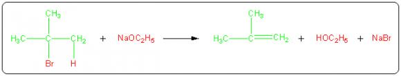
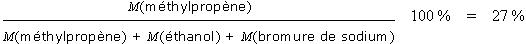
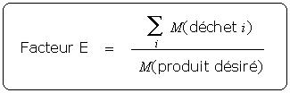

# Chimie Verte

La chimie verte ou chimie durable vise à concevoir des produits et des procédés chimiques qui réduisent ou éliminent l'usage et la génération de substances dangereuses pour la santé humaine et l'environnement.

## Principes de la Chimie Verte :

1. **Prévention des déchets**  

2. **Économie d'atomes**  
   

3. **Synthèse chimique moins dangereuse**  

   
4. **Conception de produits chimiques moins toxiques**  
  

5. **Réduction des solvants polluants**  
  

6. **Limitation des dépenses énergétiques**  

7. **Utilisation de ressources renouvelables**  
  

8. **Réduction du nombre de dérivés**  
   

9. **Utilisation des procédés catalytiques**  
   

10. **Conception de produits dégradables**  
    

11. **Analyse en temps réel pour prévenir la pollution**  
    

12. **Chimie intrinsèquement plus sûre pour éviter les accidents.**  
  
# Chimie verte

### Utilisation atomique ou économie atomique (pour mesurer l'efficacité)
Pour ce calcul, il nous faut :
- La masse molaire du produit recherché
- La masse molaire de tous les produits de l’équation

Considérons par exemple la réaction de déhydrohalogénation du 2-bromo-2-méthylpropane par l'éthanolate de sodium qui conduit au méthylpropène.

Le produit recherché est ici le méthylpropène (en vert). On classe les atomes des réactifs en deux catégories :
- Ceux qui sont incorporés dans le produit désiré (en vert)
- Ceux qui se retrouvent dans des sous-produits indésirables (en rouge)

L'utilisation atomique est dans ce cas :

> Cela signifie que même si le rendement de la réaction est de 100%, seuls 27% en masse des atomes de réactifs sont incorporés dans le produit. Les 73% qui restent constituent des déchets qu'il faudra séparer, traiter, recycler ou détruire avec un impact environnemental et financier important.

Un procédé sera d'autant plus efficace que son utilisation atomique sera proche de 100%.

### Le facteur E (pour quantifier les déchets)
Il nous faut pour ce calcul :
- La masse molaire du produit recherché
- La masse molaire de tous les produits de l’équation

Informations tirées du site : [CultureSciences Chimie](https://culturesciences.chimie.ens.fr/thematiques/chimie-organique/methodes-et-outils/les-concepts-de-la-chimie-verte-utilisation)

